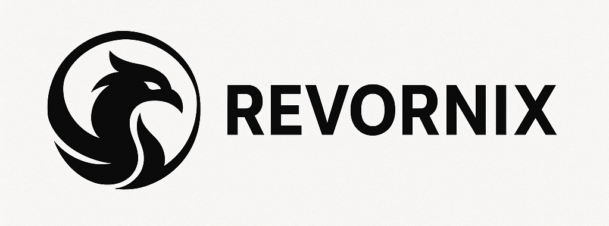

[English](./README.md) | [中文文档](/README_zh.md) | 日本語ドキュメント

## 概要

公式サイト: [https://revornix.com](https://revornix.com)

コミュニティに参加: [Discord](https://discord.com/invite/3XZfz84aPN) | [WeChat](https://github.com/Qingyon-AI/Revornix/discussions/1#discussioncomment-13638435) | [QQ](https://github.com/Qingyon-AI/Revornix/discussions/1#discussioncomment-13638435)

AI時代の情報管理ツール。Revornixは、あらゆる情報を簡単に統合し、特定の時間に完全なレポートとして提供します。


## 主な機能

- クロスプラットフォーム対応：現在はWebに対応、今後はiOSアプリとWeChatミニプログラムも対応予定。
- ワンストップ情報収集：ニュース、ブログ、フォーラムなどを一括で収集。
- ドキュメント変換＆ベクトル化保存：マルチモーダル大規模モデルを活用し、ファイルをMarkdownに変換した後、Embeddingを行い、業界トップクラスのMilvusに保存します。
- ネイティブマルチテナント：マルチテナントシステムとして設計されており、複数のユーザーが同時に利用可能で、各ユーザーは独立したドキュメントライブラリを所有できます。
- ローカル保存 & オープンソース：コードはオープンソースで、すべてのデータはローカルに保存されるため、情報漏洩の心配がありません。
- スマートアシスタント & 内蔵MCP：内蔵MCPによるAIアシスタントがドキュメントやツールと対話可能で、複数モデルの切り替えにも対応。
- 大規模モデルのシームレス統合：内蔵のモデル接続機能により、使用したい大規模モデルを自由に構成・選択可能（OpenAIプロトコル対応が必要）。
- 多言語対応 & レスポンシブ設計：中国語でも英語でも、モバイルでもPCでも快適に使用可能。

## クイックスタート

### Docker方式（推奨）

#### リポジトリをローカルにクローン

```shell
git clone git@github.com:Qingyon-AI/Revornix.git
cd Revornix
```

#### 環境変数の設定

```shell
cp .env.example .env
```

対応する環境変数ファイルを編集してください。詳しくは[環境変数設定セクション](https://revornix.com/en/docs/environment)をご覧ください。

> [!TIP]
> 通常は、ユーザー認証機構の OAUTH_SECRET_KEY パラメータだけを設定すれば十分で、その他のパラメータはデフォルトのままで問題ありません。なお、異なるサービス間で OAUTH_SECRET_KEY が一致していないと、ユーザー認証システムが連携できなくなるため、ご注意ください。

#### dockerで必要なイメージを取得して起動

```shell
docker compose up -d
```

すべてのサービスが起動したら、http://localhost にアクセスしてフロントエンド画面をご確認ください。バックエンドの起動には少し時間がかかるため、フロントエンドからのリクエストが通るまで通常10〜15分ほどかかることがあります。docker compose logs apiでバックエンドの起動状況を確認できます。

### 手動デプロイ

詳細は[公式ドキュメント（手動デプロイ方法）](https://revornix.com/en/docs/start#manual-deployment-method)をご覧ください。

## 貢献者

<a href="https://github.com/Qingyon-AI/Revornx/graphs/contributors">
  
</a>