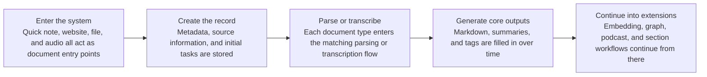
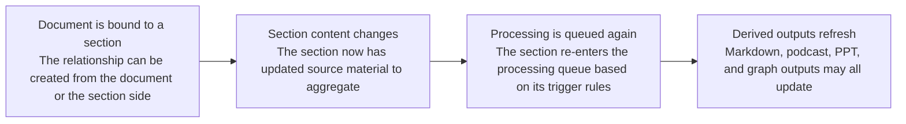

import { Callout } from 'nextra/components';

# Document Management

Document management is no longer just "collect and read later." A document can move through parsing, summarization, embedding, knowledge-graph building, podcast generation, and section updates, and the UI exposes those task states directly.

## 1. Document entry points

The create page supports four document entry types:

- Quick note
- Link
- File
- Audio

In practice:

- Quick notes support direct Markdown authoring and a write/preview switch before submission.
- The quick-note editor also supports full-page fullscreen editing for longer drafting sessions.
- Link documents depend on the website parsing engine.
- File documents depend on the file parsing engine. The upload flow accepts common document and presentation formats, including `pdf / doc / docx / ppt / pptx / jpg / jpeg / png`.
- Audio documents go through transcription first, then can continue into summary, graph, and podcast-related workflows.

<Callout>
	Except for quick notes, most document sources continue through the product as structured Markdown content plus their original source metadata.
</Callout>

## Document lifecycle sketch

## 2. Abilities you can configure at creation time

Creating a document usually means submitting both the source and some workflow choices:

- Labels
- Bound sections
- Auto summary
- Auto tagging
- Auto podcast

If you enter document creation from a section detail page, that section can already be preselected so the new document joins that section immediately.

## 3. The real workflow shown on the document detail page

After a document is created, the detail page shows the live status of each async stage rather than only the final result. Common statuses include:

- Conversion
- Transcription for audio documents
- Summary
- Embedding
- Knowledge graph
- Podcast

If a stage fails, the UI can expose retry actions. If a summary, graph, or podcast already exists but the document changed later, the detail page can also warn that the result is stale and should be regenerated.

## 4. Main capabilities on the document detail page

### Basics and configuration

You can keep editing the title, description, labels, bound sections, and cover after collection.  
These are not only presentation fields. They can affect downstream section updates and organization.

### Re-editing the Markdown body

Documents whose main body is stored as Markdown can now be edited directly from the detail page instead of requiring a fresh re-import:

- Quick notes support direct Markdown re-editing.
- Website and file documents can also revise the parsed Markdown after ingestion finishes.
- The editor supports writing, preview, and full-page fullscreen editing for longer body edits.
- Saving updates the current document body in place rather than creating a duplicate copy.

<Callout>
	Once Markdown is edited manually, Revornix marks results derived from the previous body as stale. That includes embeddings, AI summaries, knowledge graphs, podcasts, and section-side derived outputs that depend on the document body.
</Callout>

### Supplemental notes

You can add notes to a document for future reading and review.

### Document knowledge graph

Once graph generation succeeds, the detail page can show the document-specific graph and knowledge relationships.

### Document podcast

Documents can generate podcasts independently.  
If auto podcast was not enabled at creation time, you can still trigger it manually from the detail page. After success, the built-in player plays the generated audio directly.

### Related sections

The document detail page shows which sections this document belongs to, and the configuration panel lets you rebind those relationships later.

## 5. Search, filtering, and organization

The document pages support:

- Multiple list views such as mine / unread / read history / favorites
- Label filtering
- Ascending and descending time order
- List search based on title and description

Documents are not just static archives. They are upstream inputs for the rest of the knowledge workflow, so labels, read state, favorites, and section bindings all affect later organization.

## 6. How documents connect to section workflows

Documents and sections are now deeply coupled:

- You can bind sections during document creation
- You can also add documents from the section detail page
- Once a document enters a section, that section's Markdown, podcast, PPT, and graph results may need to refresh

That makes document management an upstream part of the section workflow rather than an isolated feature.

## 7. Storage split

| Data | Storage |
| --- | --- |
| Document metadata | Postgres |
| Original files / converted Markdown / related assets | [Custom File Service](../integrations/custom-file-system) |
| Document vectors | Milvus |
| Document knowledge graph | Neo4j |
| Document podcast audio | [Custom File Service](../integrations/custom-file-system) |
| Document covers and illustration-like assets | [Custom File Service](../integrations/custom-file-system) |

<Callout>
	Many document abilities depend on default resources configured in Settings, such as parse engines, summary models, and podcast engines. If these are missing, the create page and detail page will warn you directly.
</Callout>
