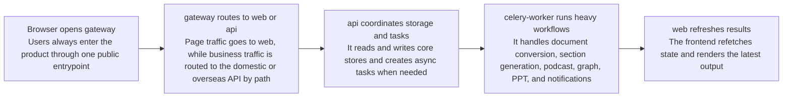
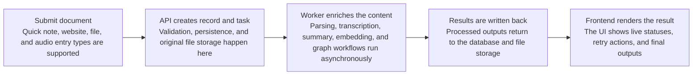
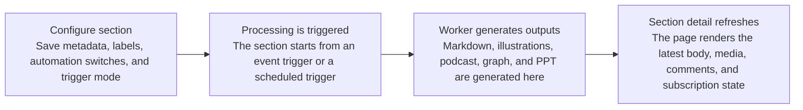

import { Callout } from 'nextra/components';

# Runtime Flow

This page explains the main runtime paths in Revornix, from user requests to background processing, public surfaces, and notification delivery. It is intended as a practical system overview of how the product works at runtime.

## Overview

The current Revornix runtime is mainly composed of:

- `gateway`: the unified public entrypoint and split-region routing layer
- `web`: the main user-facing product frontend
- `api`: the synchronous business API and orchestration entry
- `celery-worker`: the async workflow and heavy-job execution layer
- `hot-news`: the separate trending aggregation service
- PostgreSQL / Redis / Milvus / Neo4j / MinIO: the underlying data and file infrastructure

In practice, `gateway` owns the public entrypoint and path-level routing, `web` handles interaction and presentation, `api` handles state changes and access control, `celery-worker` handles long-running processing, and `hot-news` handles trend aggregation.

## Runtime sketch

## 1. User-facing request path

Most product pages follow the same main request path:

1. The browser opens `web` through the unified public entrypoint
2. `web` calls the unified public `api` entrypoint based on the page action
3. If a gateway is enabled, it routes the request to the domestic or overseas API by path
4. The target API reads from or writes to PostgreSQL, Redis, Milvus, Neo4j, and the file backend
5. The API returns the immediate response
6. `web` refreshes local state and renders the result

This path covers most synchronous interactions, including authentication, settings, document lists, section detail pages, the dashboard, Revornix AI settings, and notification management.

## 2. Document processing path

Document capabilities usually follow a two-part model: synchronous creation plus asynchronous enrichment.

1. The user submits a link, file, audio source, or quick note in `web`
2. `api` performs permission checks, default-resource checks, document creation, and original file storage
3. `api` creates a document processing task and hands heavy work to `celery-worker`
4. `celery-worker` runs website parsing, file parsing, transcription, Markdown conversion, summarization, vectorization, graph generation, and related workflows based on the document type
5. Results are written back to the database and file system
6. `web` polls or refetches API state and shows the updated status

Once completed, a document can gradually support:

- Markdown reading
- AI Q&A
- Vector retrieval
- Graph generation
- Podcast generation
- Inclusion in sections or the daily section

## 3. Section processing path

Sections also split into synchronous configuration and asynchronous generation.

1. A user creates or updates section configuration
2. `api` saves section metadata, labels, collaboration state, trigger mode, and schedule settings
3. When an event trigger or scheduled trigger fires, `api` or the scheduler starts section processing
4. `celery-worker` aggregates section documents, generates Markdown, adds illustrations, generates podcasts, builds section graphs, and creates PPT output when needed
5. After results are written back, `web` renders the body, media area, graph, comments, and subscription state on the section detail page

The daily section is a system-maintained section type, but it still follows the same underlying section-processing path with automatic defaults applied at creation time.

## 4. Revornix AI path

Revornix AI depends on models, engines, and the knowledge layer working together.

1. The user submits a question or opens a document or section context in the frontend
2. `web` calls the AI routes in `api`
3. `api` applies access control and request orchestration based on the active default models, default engines, plan entitlements, and available context
4. When the request involves document or section retrieval, `api` coordinates vector indexes, graph context, file content, and MCP capabilities
5. The result returns to `web` and is rendered as a conversation, citations, Markdown, or other structured output

This path covers:

- Revornix AI chat
- Document AI Q&A
- Section AI Q&A
- Answers expanded through retrieval and graph context

## 5. Notification and subscription path

Notifications are not a standalone content workflow. They sit on top of events and scheduled tasks.

1. The user creates notification sources, targets, and tasks in settings
2. `api` stores the rules and registers scheduled jobs when needed
3. When an event occurs or a scheduled time arrives, the notification task fires
4. `api` or `celery-worker` assembles the content and delivers it to email, Feishu, DingTalk, Telegram, or Apple devices

Notification tasks are commonly paired with:

- Daily section summaries
- Section updates
- Section subscriptions
- Section comments

## 6. Community and public-page path

The public community surfaces share the same core data model as the private workspace, but they run through dedicated public entry points.

1. A user or search engine opens `/community`, `/section/[publish_uuid]`, `/user/[id]`, or `/document/[id]`
2. `web` public SEO pages request public-facing data
3. `api` returns only the section, document, and user data that is allowed to be public
4. The page renders public content, structured metadata, and navigation relationships

This path allows public sections, public documents, and public creator pages to be accessed directly from outside the private workspace while keeping private data isolated.

## 7. Hot-search path

The hot-search capability runs through a separate service rather than the main API.

1. `web` calls the `hot-news` service through `NEXT_PUBLIC_HOT_NEWS_API_PREFIX`
2. `hot-news` aggregates ranking data from upstream sources
3. A normalized result is returned to the dashboard and hot-search pages

That means `hot-news` lives in the same monorepo but still runs as an independent process.

## 8. Local runtime order

The most common local development startup order is:

1. Start PostgreSQL, Redis, Milvus, Neo4j, MinIO, and related infrastructure through `docker-compose-local.yaml`
2. Run initialization scripts under `api`
3. Start `api`
4. Start `celery-worker`
5. Start `hot-news`
6. Start `web`
7. Start `gateway` when you want a unified public entrypoint
8. Start `docs` separately when you want to preview the documentation site

<Callout>
The current local runtime model is “infrastructure via Compose, application services started separately,” not “all application services launched directly from one Compose file.”
</Callout>
