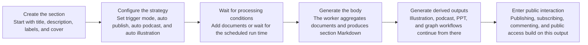
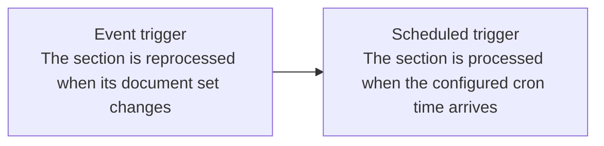

import { Callout } from 'nextra/components';

# Section Creation

The current section creation flow is no longer just "enter a title and description." In practice, you are defining a knowledge artifact that can keep updating over time.

## 1. What you can configure when creating a section

The current section create page lets you configure:

- Cover
- Title
- Description
- Labels
- Auto publish
- Auto podcast
- Auto illustration
- Section processing trigger mode

The trigger mode is especially important because it determines when the section's Markdown result and derived outputs refresh.

## Post-creation processing sketch

## 2. The two current processing trigger modes

In the current codebase, section processing supports two modes:

- Event trigger: the section is reprocessed when section content changes, such as after documents are added or bindings are updated.
- Scheduled trigger: the section runs at a configured time, which works well for daily digests, weekly summaries, and other timed outputs.

If a section is waiting for its scheduled run, the Markdown area explicitly shows that it is waiting for the next trigger instead of presenting that state as a failure.

## 3. Auto podcast and auto illustration

### Auto podcast

When enabled, the section continues into podcast generation after section processing finishes.  
If the default podcast engine is missing, both the create page and later configuration flows will warn you directly.

### Auto illustration

When enabled, the system generates illustrations from the section content and writes them back into the section Markdown.  
That is why section Markdown can temporarily contain image placeholders and then refresh when generation completes.

## 4. Auto publish

If auto publish is enabled, the section is published to the public space right after creation.  
That puts it on the path for public sharing, subscription, comments, and community discovery.

## 5. Daily Section is still a special workflow

The Daily Section still does not need manual creation.  
When the first document of the day enters the system, Revornix prepares the matching daily section and keeps updating it as more documents are added.

<Callout>
	In the current product, there is still no switch to disable the Daily Section workflow. Documents that enter the daily flow are merged into it automatically.
</Callout>

## 6. Creation is only the start

After creation, the section configuration panel still lets you adjust:

- Title, description, cover, and labels
- Auto podcast and auto illustration switches
- Trigger mode and schedule time

Those settings are part of the real processing workflow, not only display metadata.
