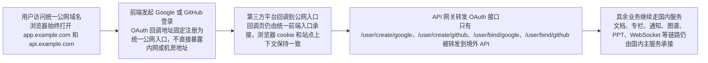

import { Callout } from 'nextra/components';

# 网关部署

当主业务服务部署在中国大陆，而 Google / GitHub 这类第三方登录必须通过境外网络访问时，Revornix 推荐使用“统一公网入口 + 分区后端服务”的部署方式。

这套方式的目标是：

- 用户始终访问同一套公网域名
- 登录回调仍然回到同一个产品入口
- 网关按路径把请求转发到国内或境外服务
- 不同服务既可以部署在同一台服务器上，也可以拆到不同服务器

仓库中的实际实现位于 `gateway/` 目录，是一个可以独立启动的网关服务，而不是只有静态配置样例。

## 推荐边界

- `app.example.com`：统一前端公网入口
- `api.example.com`：统一 API 公网入口
- 国内服务：`web`、主 `api`、`celery-worker`、`hot-news`
- 境外服务：负责 Google / GitHub 登录换 token 与拉取用户信息的 `api`

这里的“境外服务”可以是：

- 一台单独的境外 API 服务器
- 一组只承接认证流量的 API 实例
- 与其他境外服务共机部署的认证节点

## 运行示意

## 为什么要统一公网入口

如果前端直接把 OAuth 回调地址写成当前机器的实际域名，或者后端直接使用请求落点服务器的 `base_url` 来拼接回调地址，就会出现这些问题：

- OAuth 回调地址会跟着部署机器变化，难以在 Google / GitHub 控制台稳定登记
- 回调页可能落到与主站不同的域名，导致浏览器登录态无法自然复用
- 用户可能在国内主站和境外认证页之间来回跳转，体验和稳定性都会变差

当前仓库已经针对这一点做了适配：

- `web` 的第三方登录入口与回调跳转统一使用 `NEXT_PUBLIC_HOST`
- `api` 的 Google / GitHub 回调地址统一优先使用 `WEB_BASE_URL`

这两个值都应该指向统一公网入口，而不是某一台真实业务机器的内网地址。

## 需要这样配置

### Web

- `NEXT_PUBLIC_HOST`：填写前端统一公网入口，例如 `https://app.example.com`
- `NEXT_PUBLIC_API_PREFIX`：填写统一 API 公网入口，例如 `https://api.example.com`

### API / Worker

- `WEB_BASE_URL`：填写与 `NEXT_PUBLIC_HOST` 一致的统一公网入口，例如 `https://app.example.com`

<Callout type='warning'>
`WEB_BASE_URL` 不应再填写某一台国内 API 服务器自己的地址。对于 Google / GitHub 登录，它承担的是“公网回调入口”角色，而不是“当前 API 进程监听地址”。
</Callout>

## 网关如何分流

推荐只把这些接口转发到境外 API：

- `/user/create/google`
- `/user/create/github`
- `/user/bind/google`
- `/user/bind/github`

其余接口继续指向国内主 API，包括：

- 文档、专栏、PPT、播客、图谱
- 通知和 WebSocket
- MCP
- 会员、计费与支付联动

这样可以把必须出海的流量收敛到最小范围，不需要把整套主业务一起迁到境外。

## 同机或分机部署

这套方案不要求所有服务都拆开部署：

- 如果资源紧张，可以让 `web` 和国内主 `api` 在同一台国内服务器
- 如果需要，也可以让境外认证 `api` 和其他境外服务在同一台服务器
- 如果需要更细粒度治理，也可以把 `web`、国内 `api`、境外认证 `api`、`hot-news` 分别部署到不同机器

网关层只关心“某个路径应该转发给哪个 upstream”，并不要求 upstream 必须是一机一服务。

## 仓库中的样例

仓库已经提供了一份 Nginx 样例配置：

- [`deploy/gateway/nginx/revornix.gateway.conf.example`](/Users/kinda/Developer/Revornix/deploy/gateway/nginx/revornix.gateway.conf.example)

同时也提供了实际可运行的 Go 网关服务目录：

- [`gateway/README.md`](/Users/kinda/Developer/Revornix/gateway/README.md)
- [`gateway/cmd/gateway/main.go`](/Users/kinda/Developer/Revornix/gateway/cmd/gateway/main.go)

这份样例展示了三件事：

- `app.example.com` 代理前端
- `api.example.com` 默认代理国内主 API
- 只有 Google / GitHub 登录与绑定接口被单独转发到境外 API

## 建议落地顺序

1. 先确定统一公网域名
2. 把 `NEXT_PUBLIC_HOST`、`NEXT_PUBLIC_API_PREFIX`、`WEB_BASE_URL` 改成公网入口
3. 先让所有流量都走同一套服务，确认公网入口可用
4. 再把 Google / GitHub 相关接口从 API 网关切到境外服务
5. 最后根据需要继续拆分 `hot-news`、通知、MCP 或其他独立服务
