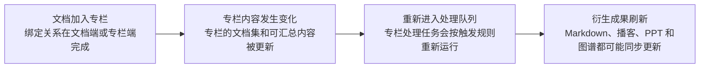

import { Callout } from 'nextra/components';

# 文档管理

文档工作流不只是“收录后看一眼”。文档会进入解析、总结、向量化、知识图谱、播客等链路，并且这些状态都能在界面里直接看到。

## 1. 文档入口

创建页支持四种入口：

- 速记文档
- 链接文档
- 文件文档
- 音频文档

其中：

- 速记文档支持直接写 Markdown，并且创建前就可以切换到预览模式。
- 速记文档编辑器支持整页全屏编辑，适合长内容整理与沉浸式写作。
- 链接文档依赖网页解析引擎。
- 文件文档依赖文件解析引擎，上传入口支持常见文档与演示文件，包括 `pdf / doc / docx / ppt / pptx / jpg / jpeg / png`。
- 音频文档会进入转写流程，后续再进入总结、图谱等能力链路；如果开启会议记录模式，转写结果会额外包含说话人区分和可跳转时间戳。

<Callout>
	除速记文档外，大部分文档源在进入系统后，都会以“结构化后的 Markdown 内容 + 原始来源信息”的方式继续参与后续工作流。
</Callout>

## 文档生命周期示意

## 2. 创建时可直接配置的能力

创建文档时，除了提交来源，还可以一并配置：

- 标签
- 归属专栏
- 自动总结
- 自动打标
- 自动转写（音频文档）
- 会议记录模式（音频文档）
- 自动播客

如果是从专栏详情页跳转进来的创建入口，对应专栏会自动预选，这样文档创建后会直接进入该专栏。

## 3. 文档详情页里的真实工作流

文档创建完成后，详情页会展示它在各个异步链路里的状态，而不是只显示最终结果。常见状态包括：

- 转换状态
- 转写状态（音频文档）
- 总结状态
- 向量化状态
- 知识图谱状态
- 播客状态

如果某个阶段失败，界面里会给出重试入口；如果总结、图谱、播客已经生成，但文档内容后来又更新了，界面也会提示结果已经变旧，需要重新生成。

## 4. 文档详情页包含的主要能力

### 基础信息与配置

文档标题、描述、标签、所属专栏、封面都可以在详情页继续调整。  
这些修改会影响后续专栏内容更新，因此不是“只改展示文案”，而是会回到真实内容链路里。

### Markdown 正文再编辑

对于以 Markdown 作为正文来源的文档，详情页现在支持直接重新编辑正文，而不需要绕回原始来源重新导入：

- 速记文档可以直接重新编辑其 Markdown 正文。
- 网站文档与文件文档在完成解析后，也可以对解析出的 Markdown 继续修订。
- 编辑器支持写作、预览与整页全屏编辑，适合处理更长的正文内容。
- 保存后会直接覆盖当前文档正文，而不是额外生成一份副本。

<Callout>
	Markdown 被手动修改后，系统会把依赖旧正文生成的结果标记为“已过期”。这类结果包括向量化、AI 总结、知识图谱、播客，以及关联专栏中依赖该正文的派生产物。
</Callout>

### 音频转写与会议记录模式

音频文档在完成转写后，会把转写结果作为 Markdown 正文继续参与总结、图谱、向量化和播客等下游链路。普通转写适合单人音频或不需要区分说话人的素材。

如果在创建音频文档时开启“会议记录模式”，Revornix 会请求支持分段结果的转写引擎，并生成更适合会议、访谈和多人讨论的正文：

- 每段内容会带有说话人标签，例如 `S1`、`S2`。
- 每段内容会带有时间戳，新的转写结果会显示到毫秒级，例如 `00:07.860`。
- 点击正文中的时间戳可以直接跳到源音频对应位置。
- 全屏音频播放器的 Transcript 面板也会显示同一份分段文本，并支持点击段落跳转。
- 右侧侧栏会展示会议洞察，包括概要、待办和决定。
- 说话人名称可以在详情页中重命名，例如把 `S1` 改成真实姓名；重命名只影响显示名，不会修改原始转写文件。

<Callout type='info'>
	会议记录模式依赖转写引擎的分段能力。若默认音频转写引擎不支持分段或说话人区分，创建页会阻止开启会议记录模式，或提示切换到支持该能力的引擎。
</Callout>

### 补充笔记

你可以给文档追加补充笔记，方便后续阅读和整理。

### 文档知识图谱

如果图谱已经生成，文档详情页可以直接查看该文档对应的知识点和关联关系。

### 文档播客

文档支持单独生成播客。  
如果你在创建时没有开启自动播客，也可以在详情页手动触发；生成成功后会直接以内置播放器播放。

### 关联专栏

文档详情页会显示它关联的专栏；你也可以在编辑配置时重新调整它属于哪些专栏。

### 文档协作

文档可以邀请其他用户作为协作者，模型与专栏完全一致：身份只表达关系（创建者 / 协作者），权限只表达协作能力（FULL_ACCESS / READ_AND_WRITE / READ_ONLY），具体能力按下表分配：

| 操作 | 创建者 | FULL_ACCESS | READ_AND_WRITE | READ_ONLY |
| --- | :---: | :---: | :---: | :---: |
| 阅读、评论、笔记、收藏、AI 问答 | ✓ | ✓ | ✓ | ✓ |
| 编辑 Markdown 正文 | ✓ | ✓ | ✓ | ✗ |
| 编辑文档元数据（标题/描述/封面/标签） | ✓ | ✓ | ✓ | ✗ |
| 触发任务（AI 总结、向量化、转写、播客、图谱、Markdown 转换） | ✓ | ✓ | ✓ | ✗ |
| 邀请新协作者 / 审批访问申请 | ✓ | ✓ | ✗ | ✗ |
| 修改、移除协作者 | 所有协作者 | 仅自己邀请/审批进来的协作者 | ✗ | ✗ |
| 修改文档归属的专栏 | ✓ | ✗ | ✗ | ✗ |
| 发布 / 取消发布 | ✓ | ✗ | ✗ | ✗ |
| 删除文档 | ✓ | ✗ | ✗ | ✗ |

<Callout type='info'>FULL_ACCESS 能把人请进来，但只能管理自己请进来的协作者；修改文档所属专栏、发布、删除这类高风险操作仍然只属于创建者。规则同时由后端 API 强制和前端 UI 隐藏。</Callout>

## 5. 搜索、筛选与组织

文档列表页支持：

- 我的文档 / 已读 / 未读 / 最近阅读 / 收藏 等不同维度浏览
- 标签筛选
- 时间正序 / 倒序
- 按标题和描述做列表检索

文档不只是静态存档，而是整个知识工作流的输入源，所以标签、阅读状态、收藏状态、是否加入专栏这些信息都会影响你后续的整理方式。

## 6. 与专栏工作流的关系

文档和专栏是双向关联的：

- 创建文档时可以直接指定专栏
- 也可以在专栏详情页里把文档加入专栏
- 文档被加入专栏后，专栏的 Markdown、播客、PPT、知识图谱等结果都可能重新进入更新链路

这意味着“文档管理”本身就是专栏工作流的上游。

## 7. 存储拆分

| 数据 | 存储位置 |
| --- | --- |
| 文档元数据 | Postgres |
| 原始文件 / 转换后的 Markdown / 相关产物 | [自定义文件服务](../integrations/custom-file-system) |
| 音频转写 Markdown / 会议分段 JSON | [自定义文件服务](../integrations/custom-file-system) |
| 文档向量 | Milvus |
| 文档知识图谱 | Neo4j |
| 文档播客音频 | [自定义文件服务](../integrations/custom-file-system) |
| 文档封面与插图类资源 | [自定义文件服务](../integrations/custom-file-system) |

<Callout>
	文档的很多能力都依赖你在设置中配置默认解析引擎、默认总结模型、默认播客引擎等资源；如果这些资源未配置，创建页和详情页会直接提示你补齐。
</Callout>
