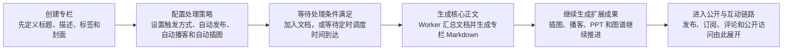
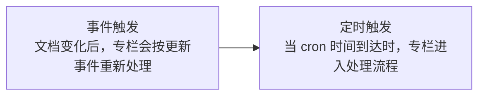

import { Callout } from 'nextra/components';

# 专栏创建

专栏创建页不只是填写标题和描述，它定义的是一个会持续更新的知识产物。

## 1. 创建普通专栏时可配置的内容

普通专栏创建页支持直接配置：

- 封面
- 标题
- 描述
- 标签
- 自动发布
- 自动播客
- 自动插图
- 专栏处理触发方式

其中“专栏处理触发方式”决定专栏 Markdown、总结和衍生内容何时刷新。

## 专栏创建后的处理示意

## 2. 专栏处理的两种触发方式

专栏处理支持两种模式：

- 事件触发：当专栏内文档发生变化时触发，例如新增文档、修改绑定关系后重新处理。
- 定时触发：在你设定的调度时间点处理专栏，适合日报、周报、定时汇总等场景。

如果是定时触发，在调度时间到来之前，专栏正文区域会明确提示它还在等待下一次触发，而不是直接显示为失败或空白。

## 3. 自动播客与自动插图

### 自动播客

开启后，专栏在完成内容处理后会继续进入播客生成链路。  
如果默认播客引擎未配置，创建页和后续配置页都会直接提示你去设置资源。

### 自动插图

开启后，系统会根据专栏内容生成插图，并把生成结果写回专栏 Markdown。  
这也是为什么专栏正文里有时会出现后生成的图片位，并在完成后自动刷新。

## 4. 自动发布

开启自动发布后，专栏在创建完成后会直接发布到公开空间。  
这意味着它可以被社区浏览、被公开链接访问，并进入后续分享、订阅与评论链路。

## 5. 今日专栏仍然是特殊工作流

今日专栏仍然不需要手动创建。  
当你当天新增第一篇文档后，系统会自动准备对应的今日专栏，并在后续文档继续加入时不断更新总结结果。

<Callout>
	今日专栏没有单独的关闭入口。文档进入当天工作流后，就会被并入今日专栏链路。
</Callout>

## 6. 创建之后并不会停止

专栏创建完成只是起点。后续你仍然可以在专栏配置里继续调整：

- 标题、描述、封面、标签
- 自动播客 / 自动插图 开关
- 触发类型与调度时间

这些改动会真实影响后续的专栏处理结果，而不是只改静态展示。
